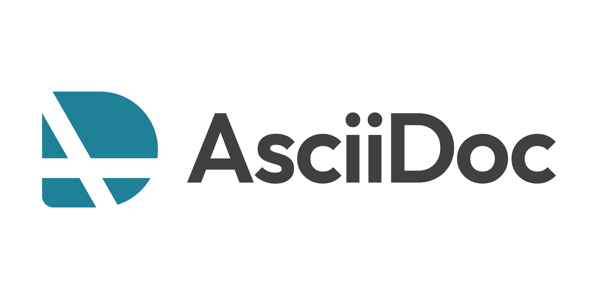

== Cheatsheet Adoc

= AsciiDoc Cheatsheet

== Headers
= Document Title (Level 0)
== Level 1 Section
=== Level 2 Section
==== Level 3 Section
===== Level 4 Section
====== Level 5 Section

== Text Formatting
*bold text*
_italic text_
*_bold italic text_*
`monospace text`
#highlighted text#
^superscript^
~subscript~

== Lists
=== Unordered Lists
* Item 1
** Subitem 1.1
** Subitem 1.2
* Item 2

=== Ordered Lists
. First item
. Second item
.. Subitem 2.1
.. Subitem 2.2
. Third item

=== Checklist
- [ ] Unchecked item
- [x] Checked item

== Links
https://example.com[Link text]
link:learning.pdf[Link to local file]

== Images

image::https://picsum.photos/id/237/200/300[Alt text,width=200,height=300]

== Blockquotes
[quote, Author Name]
____
This is a blockquote.
It can span multiple lines.
____

== Code Blocks
[source,python]
----
def hello_world():
    print("Hello, World!")
----

== Tables
|===
| Header 1 | Header 2

| Cell 1   | Cell 2
| Cell 3   | Cell 4
|===

== Admonitions
NOTE: This is a note admonition.

TIP: This is a tip admonition.

IMPORTANT: This is an important admonition.

WARNING: This is a warning admonition.

CAUTION: This is a caution admonition.

== Horizontal Rule
'''

== Footnotes
This is a sentence with a footnote.footnote:[This is the footnote text.]

== Comments
// This is a comment that won't be rendered

== Includes
include::{docfile}/../../topics.adoc[]

== Attributes
:attribute-name: value
{attribute-name}

== Cross-references
<<target-id,Custom Link Text>>

[#target-id]
== Target Section

== Keyboard, Button, and Menu Macros
kbd:[Ctrl+Alt+Delete]
btn:[OK]
menu:File[Open]

== URLs
https://asciidoctor.org

== Escaping Special Characters
\*This text is surrounded by literal asterisks*

== Passthrough
++++

  This is raw HTML that will be passed through unchanged.

++++
